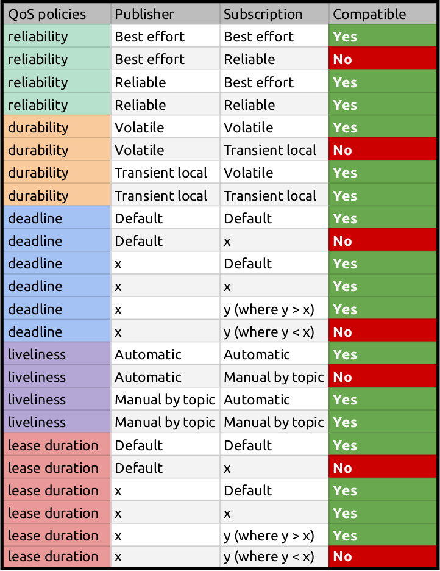
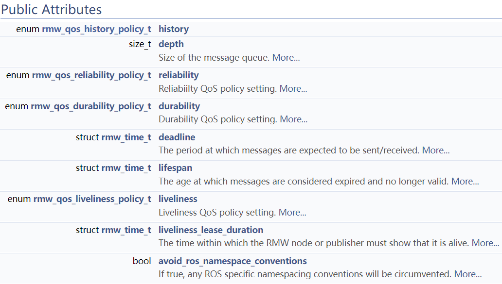
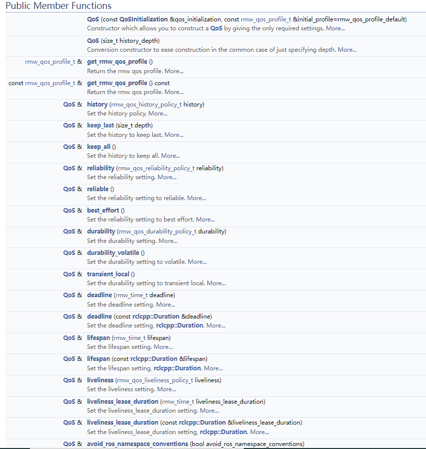

# QoS

## 简介

ROS2底层数据传输依靠DDS，这使得我们可以精细化管理通信服务质量。QoS规则中包含了多种策略，可以根据实际需要和网络通信情况进行配置。

一组QoS“策略”组合形成QoS“配置文件”。

基本的QoS配置文件目前包括下列策略的设置：

- 历史记录（History），可以设置为以下两个选项之一：
  - 保留最后（Keep last）：仅可以存储最多N个样本，可通过“队列深度”选项进行配置。
  - 保留全部（Keep all）：可以存储所有样本，但取决于底层中间件的配置资源限制。

- 深度（Depth），可以设置以下参数：
  - 队列大小（Queue size）：仅在“历史记录”策略设置为“保留最后”的情况下才可设置。

- 可靠性（Reliability），可以设置为以下两个选项之一：
  - 尽力而为（Best effort）：尝试传递样本，但若网络不稳定，可能会丢失样本。
  - 可靠（reliable）：保证传递所有样本，为此可能要重试多次。

- 持久性（Durability），可以设置为以下两个选项之一：
  - 瞬态本地（Transient local）：发布者节点负责为“后期加入”或“迟到的”订阅者节点保留样本。
  - 易变性（Volatile）：未尝试保留样本。

- 时间期限（Deadline），可以设置以下参数：
  - 持续时间（Duration）：发布到某个话题的前后消息之间的预期最大时间量。

- 寿命（Lifespan），可以设置以下参数：
  - 持续时间（Duration）：从发布到接收未被认为已过时或过期的消息（过期消息会被静默丢弃，且实际上永远不会接收到）之间的最长时间。

- 活力（Liveliness），可以设置为以下两个选项之一：
  - 自动申明（Automatic）：在节点的任何一个发布者发布一条消息时，系统会将该节点的所有发布者自动视为还要存活另一个“租期”。
  - 按话题手动申明（Manual by topic）：如果通过调用某个发布者的API手动申明该发布者仍然存活，则系统会认为该发布者还要存活另一个“租期”。

- 租期（Lease Duration），可以设置以下参数：
  - 持续时间（Duration）：在系统认为某个发布者失去生命力（失去生命力可能表示存在故障）之前，该发布者必须表明其存活的最长时间。

对于每个不是“持续时间”的策略，还有使用基础中间件默认值的“系统默认值”选项。对于每个“持续时间”策略，也有一个未指定持续时间的“默认”选项，对于这个“默认”选项，底层中间件通常会将其解释为无限长的持续时间。

### 策略兼容性

由于**两个节点的QoS设置不兼容将没法通信**，故两个节点设置QoS的策略要兼容。




### 查看话题QoS

```shell
$ ros2 topic info /image --verbose
```


## CPP

### 类rmw_qos_profile_t

#### 成员变量

包括如下：



- history是一个rmw_qos_history_policy_t枚举类型变量

  定义了history规则，可选的枚举常量有：

  - RMW_QOS_POLICY_HISTORY_SYSTEM_DEFAULT

  - RMW_QOS_POLICY_HISTORY_KEEP_LAST

  - RMW_QOS_POLICY_HISTORY_KEEP_ALL

- rmw_qos_reliability_policy_t

  定义了可靠性规则，可选的枚举有：

  - RMW_QOS_POLICY_RELIABILITY_SYSTEM_DEFAULT

  - RMW_QOS_POLICY_RELIABILITY_RELIABLE（确保数据被传送到，可能会重传多次，导致数据延时严重）

  - RMW_QOS_POLICY_RELIABILITY_BEST_EFFORT（尽力传送数据，但是网络不稳定可能会丢弃一些数据）

- rmw_qos_durability_policy_t

  定义了是否进行数据保留规则，可选的枚举有：

  - RMW_QOS_POLICY_DURABILITY_SYSTEM_DEFAULT
  - RMW_QOS_POLICY_DURABILITY_TRANSIENT_LOCAL（为后订阅话题的订阅者保留数据，比如map_server发布map的Qos策略）
  - RMW_QOS_POLICY_DURABILITY_VOLATILE（不为后订阅话题的订阅者保留数据，比如订阅传感器数据的节点）

- deadline

  设置数据被发布的**间隔时间**。比如：像cmd_vel等控制命令就希望是固定间隔时间下发的。

  间隔时间数据类型为`rmw_time_t`结构体（包括了uint64_t 	sec，uint64_t 	nsec）。

- lifespan

  设置数据从发布到被接收的最大**间隔时间**。超过该时间将被认为是过时的数据，直接丢弃了。这对于传感器数据来说是很重要的。因为过时的传感器数据毫无用处。

  间隔时间数据类型为`rmw_time_t`结构体（包括了uint64_t 	sec，uint64_t 	nsec）。

#### 常用qos

头文件：**qos_profiles.h**

https://docs.ros2.org/foxy/api/rmw/qos__profiles_8h.html

https://docs.ros2.org/foxy/api/rmw/qos__profiles_8h_source.html

- 默认

  rmw_qos_profile_system_default
  
- 用于传感器数据传输

  rmw_qos_profile_sensor_data
  
  Qos=(Keep last, 5, Best effort, Volatile)

- 主题

  rmw_qos_profile_default

  Qos=(Keep last, 10, Reliable, Volatile)

rmw_qos_profile_parameters

rmw_qos_profile_services_default

rmw_qos_profile_parameter_events

rmw_qos_profile_system_default


使用示例：

```c++
rmw_qos_profile_t custom_qos_profile = rmw_qos_profile_sensor_data;
```


### 类rclcpp::QoS

该类是QoS设置的封装，其中包括一个**rmw_qos_profile_t**成员，用于存储了QoS的配置，另外提供了很多成员函数来对**rmw_qos_profile_t**成员属性进行设置，从而实现配置QoS。



QoS类包括了很多成员函数，实现各种配置需求，例如keep_last函数如下：

```c++
QoS &
QoS::keep_last(size_t depth)
{
  rmw_qos_profile_.history = RMW_QOS_POLICY_HISTORY_KEEP_LAST;
  rmw_qos_profile_.depth = depth;
  return *this;
}
```

创建QoS类

```c++
// 通过QoSInitialization创建
rclcpp::QoS qos(rclcpp::KeepLast(1))

// 通过指定history大小创建
rclcpp::QoS qos(10);    // 等价于QoS qos(KeepLast(10))
```

## 消息订阅和发布

在创建消息订阅和发布并设置QoS时，都有多个重载函数，可以传入`rmw_qos_profile_t`类型数据，或者传入`rclcpp::QoS`实例化对象，甚至也可以直接传入一个整形数据（表示history_depth)。

### 传入QoS对象

- 创建发布者

```c++
// Create a publisher using the QoS settings to emulate a ROS1 latched topic
  occ_pub_ = create_publisher<nav_msgs::msg::OccupancyGrid>(
    topic_name,
    rclcpp::QoS(rclcpp::KeepLast(1)).transient_local().reliable());
```

- 创建订阅者

```c++
// https://github.com/ros2/ros2/wiki/About-Quality-of-Service-Settings
rclcpp::QoS depth_qos(10);
depth_qos.keep_last(10);
depth_qos.best_effort();
depth_qos.durability_volatile();

// Create depth map subscriber
mDepthSub = create_subscription<sensor_msgs::msg::Image>(
    		"depth", 
            depth_qos,
    		std::bind(&MinimalDepthSubscriber::depthCallback, this, _1));
```


### 传入rmw_qos_profile_t类型数据

- 创建发布者：发布图像

```c++
rmw_qos_profile_t custom_qos_profile = rmw_qos_profile_sensor_data;

pub_pod_image    = this->create_publisher<sensor_msgs::msg::Image>("pod/image", custom_qos_profile);
```

- 创建发布者：通过image_transport发送图像。

```c++
rmw_qos_profile_t custom_qos_profile = rmw_qos_profile_sensor_data;
camera_info_pub_ = image_transport::create_camera_publisher(this, 
                                    "image", 
                                    custom_qos_profile);
```

- 创建订阅者：image_transport。

```c++
rclcpp::QoS mVideoQos(10);

mVideoQos.keep_last(10);
mVideoQos.reliable();
mVideoQos.durability_volatile();

// Create camera pusblisher for converted image topic
mPubBgr = image_transport::create_camera_publisher(this, 
                           "~/zed_image_3ch", 
                           mVideoQos.get_rmw_qos_profile());

// Create camera subscriber
mSubBgra = image_transport::create_camera_subscription( this,
                          "zed_image_4ch",
                          std::bind(&ZedRgbCvtComponent::camera_callback,
                                   this,_1,_2),
                          "raw",
                          mVideoQos.get_rmw_qos_profile());
```


## 网络延迟

```shell
# 测试Qos设置，手动加载网络延迟
$ sudo tc qdisc add dev lo root netem loss 5%
# 最后删除网络延迟配置
$ sudo tc qdisc delete dev lo root netem loss 5%
# 检查
$ tc qdisc show
```

