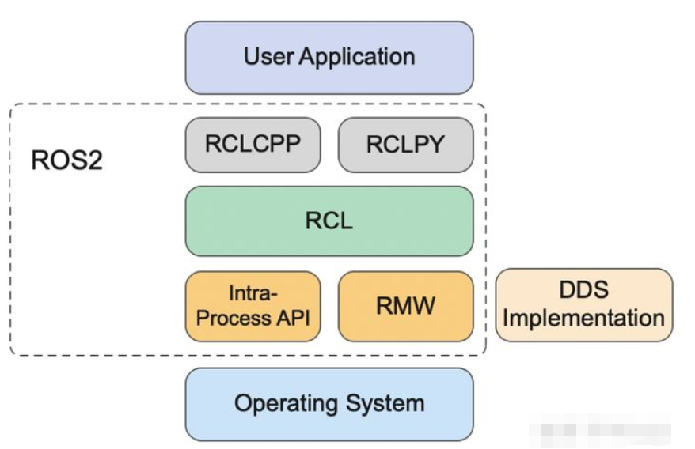
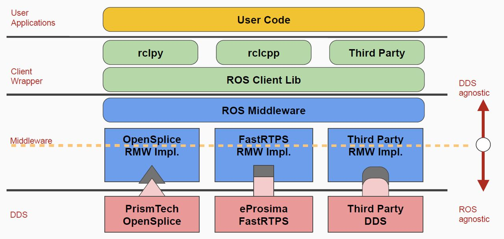
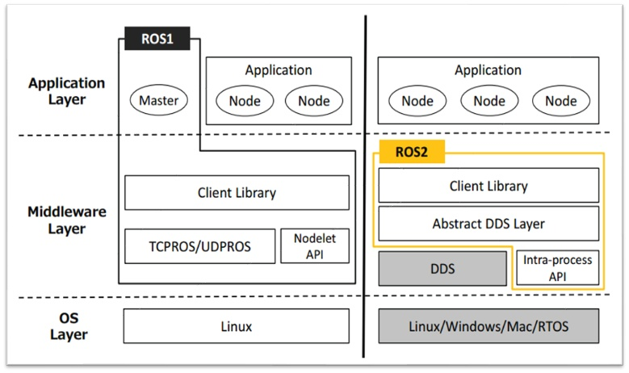
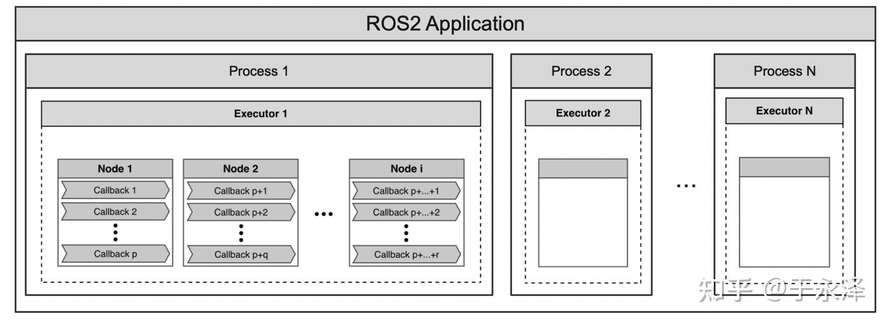

# ROS2简介

## ROS生态

**ROS**（Robot Operating System）不应该被侠义的理解为机器人操作系统，广义来说，它是一个机器人开发集合套件，提供了机器人软件框架、工具、模块，并且有一个聚集了一大批机器人开发者的社区。


> The Robot Operating System (ROS) is a set of software libraries and tools that help you build robot applications. From drivers to state-of-the-art algorithms, and with powerful developer tools, ROS has what you need for your next robotics project. And it's all open source.

- plumbling

  节点通信机制，极大简化了“线程”通信，提供了隔离机制，更容易开发、维护、调试。

- tools

  ROS提供了launch, introspection, debugging, visualization, plotting, logging, and playback等一系列工具。gazebo，rviz，CLI，rosbag2。

- capabilities

  不需要重复造轮子，ROS包含了驱动、算法等成熟模块，用于你搭积木，专注于应用开发！

- community

  社区

## 架构

### ROS2

ROS2基础架构图如下所示：



ROS2的通信是基于成熟的DDS，DDS是一套协议标准，各厂商根据该标准进行了不同实现。ROS2提供了一套标准中间件RMW（ros middle ware）将DDS接入进来，然后ROS2提供了RCL（ros client library），用户应用程序编程语言可以选择C++或者python，需要对应的调用rclcpp或rclpy提供的API。

各级功能：

- RCLCPP/RCLPY

  threading model，Intra-process communication

- RCL

  Name&namespace，Time，Parameters，Console logging

更详细的架构图如下：



### ROS vs ROS2



## 学习资料

### 基础资料

- 官方文档：

  [Tutorials — ROS 2 Documentation: Foxy documentation](https://docs.ros.org/en/foxy/Tutorials.html)

- API-rclcpp：

  [rclcpp: rclcpp: ROS Client Library for C++ (ros2.org)](https://docs.ros2.org/foxy/api/rclcpp/)

- API-RCL：

  https://docs.ros2.org/latest/api/rcl/

> 可以通过修改网址内ROS2版本，进行版本文档的切换，例如将网址中的foxy换成dashing，就可以进入dashing版本的说明文档网页。

### ROS2 package相关资料

- 功能包索引列表ROS Index：

  地址：https://index.ros.org/packages/page/1/time/

  该列表包括了ROS1 ROS2所有的开源功能包，并且包括了github仓库链接、相关使用或API链接。可以通过页面提供的检索功能找到感兴趣的功能包相关资料。

  例如[geometry_msgs相关说明](https://index.ros.org/p/geometry_msgs/github-ros2-common_interfaces/#foxy)。

- 功能包API：

  这个是由doxygen生成的API网页，包括了各功能包的API说明。

  例如tf2相关API说明在[tf2: Main Page (ros.org)](http://docs.ros.org/en/api/tf2/html/index.html)。

- ROS2各功能包的详细资料

  http://docs.ros.org/en/ros2_packages/

  例如pluginlib的APIhttp://docs.ros.org/en/ros2_packages/humble/api/pluginlib/

## 基本概念理解

### 包package

ROS2的主要任务之一是解决代码复用问题，使开发人员不需要独立造轮子，而是使用现有的轮子去“搭积木”，package就是搭积木的轮子单元！

- 一个package就是一个完整的cmake工程
- 使用现有的轮子，就是通过拷贝package的方式，直接移植到新的工程
- 工程编译时会递归调用各级目录下的CMakeLists.txt

### 节点node

节点是ROS2运行的最小单位，一个package下可以定义多个节点，可以把节点理解为一个独立运行的进程，而这些节点进程之间通过topic进行通信。

### 消息msg

这里的消息指广义上的消息，包括了msg，srv，action。

如何使用消息？

- ROS标准消息，如std_msgs，sensor_msgs，推荐
- 自定义消息

### 启动launch

一个工程中可能包括很多节点，一个个手动启动节点显然非常繁琐。故ROS2提供了节点启动管理机制，通过launch文件！其功能主要有：

- 节点启动
- 参数加载，加载.yaml文件，用于大量定义和管理参数

启动文件一般都放到package下的launch文件夹。

ROS2的launch文件有多种文件格式，使用最多的是python文件格式，功能最强大，一般定义为**.launch.py**。

### 日志

#### 运行日志

在程序中，`RCLCPP_INFO`不仅能够在终端打印，而且是自动保存至本机，可以用于后续查看运行情况。

launch启动后会提示记录的文件路径，launch日志记录的位置如：

```shell
/home/alex/.ros/log/2021-11-03-16-18-06-525630-alex-Mi-Gaming-Laptop-15-6-20322
```

注意这个是一个文件夹，里面会包含一个`/launch.log`文件。


#### rosbag2

ROS2日志记录基于数据库sqlite3，所有的日志保存为.db3的文件。

- 日志记录
- 回放

### CLI tools

CLI（client library interface）工具是ROS2提供的一系列终端命令，用于节点启动、话题查看等等。

- ros2 node/topic/interface
- rqt

### 多机通信-域

ROS2 的诞生就是为了解决ROS1中分布式通信严重依赖中心节点（master）的问题，在ROS2中通过DDS（节点发现机制）实现了去中心化。

ROS2内各**主机**之间通信是基于**域(ROS_DOMAIN_ID)**的，相同域内各主机之间可以通信，不同域内各主机之间不可以通信。避免了消息风暴。

> 这里主机就是指一台计算机。

主机默认的域为0，开发人员可以自定义。只需要在`~/.bashrc`文件中进行设置即可。

```shell
# 1、在当前终端定义域
export ROS_DOMAIN_ID=<your_domain_id>
# 2、在bashrc中定义域
echo "export ROS_DOMAIN_ID=<your_domain_id>" >> ~/.bashrc
```

### 调试

#### rqt

#### rviz

#### gazebo

建模与仿真

## ROS2应用程序模型



## ROS2工程

### 通用工程目录结构

```python
|-- project/                # 工程主目录
    |-- build/              #
    |-- install/            # 编译后，
    |-- log/                # 编译相关，编译日志
    |-- src/                # 代码目录
    	|-- apps/               # <任务应用相关>
    	    |-- auto_landing/   # [package，应用1：自主降落]
    	    	|-- include/         # 头文件
    	    	|-- src/             # 源文件，存放节点
    	    	|-- launch/          # launch文件，启动节点
    	    	|-- config/          # 配置文件
    	    	|-- CMakeLists.txt   # package中node编译、安装规则
    	    	|-- package.xml
    	    |-- auto_attack/    # [package，应用2：自主攻击]
    	|-- modules/            # <模块相关>
    		|-- detector/       # [package，目标检测]
            |-- tracker/        # [package，目标跟踪]
    	|-- drivers/            # <底层驱动相关>
        	|-- link/           # [package，数据链]
            |-- pod/            # [package，吊舱驱动]
        |-- onboard_msgs/       # <自定义消息>
        	|-- msg/                # message文件定义
            |-- srv/                # service文件定义
            |-- action/             # action文件定义
            |-- CMakeLists.txt  
    |-- utils/                  # 相关工具库
    |-- third_pkg/
    
~/.ros/log/                     # 运行日志
```

